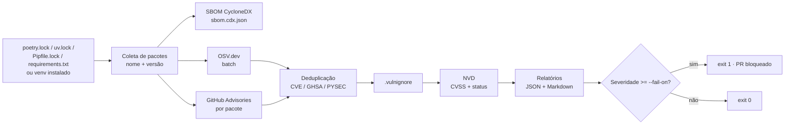

# ci: geração de SBOM e scan de vulnerabilidades nas dependências Python

**Tipo:** Segurança / CI
**Branch:** `chore/dependency-vuln-scan` → `main`
**Tickets:** REV-XXX (épico), REV-XXX (story)
**Prioridade:** Alta, fecha uma lacuna de segurança na cadeia de dependências

---

## Contexto

Hoje não temos nenhuma verificação automática das bibliotecas de terceiros que usamos. Se uma versão que está em produção recebe uma CVE, ou se um pacote é comprometido (typosquatting, conta de mantenedor invadida, versão maliciosa publicada no PyPI), a gente só descobre por acaso.

Isso é um risco direto de segurança e também de auditoria: não conseguimos responder com rapidez "estamos expostos à CVE X?" nem apresentar um inventário formal (SBOM) do que roda no sistema.

## O que este PR faz

Adiciona um scanner em Python, sem dependências externas, que:

1. **Gera um SBOM** (Software Bill of Materials) no padrão **CycloneDX 1.5**, com o nome, a versão e o `purl` de cada dependência.
2. **Consulta bases públicas de vulnerabilidades** para cada `pacote==versão`.
3. **Bloqueia o PR** quando encontra vulnerabilidade de severidade `HIGH` ou `CRITICAL`.
4. **Publica o relatório** no resumo do job do GitHub Actions e como artefato baixável.

### Fontes consultadas

| Fonte | Papel |
|---|---|
| [OSV.dev](https://osv.dev) | Busca principal em lote por pacote + versão. Agrega o GitHub Advisory Database, os avisos da PyPA e os relatórios de pacotes maliciosos da OpenSSF (`MAL-*`). |
| [GitHub Advisory Database](https://github.com/advisories) | Consulta direta por pacote, usando o `GITHUB_TOKEN` do próprio Actions. |
| [NVD](https://nvd.nist.gov) | Enriquecimento de cada CVE com score CVSS e status (ex.: CVE rejeitada). |
| [CVE.org](https://www.cve.org) | Link canônico para o registro oficial de cada CVE no relatório. |

> CVE.org e NVD não permitem busca por "pacote PyPI + versão", só por ID de CVE. Por isso o match de pacote é feito via OSV e GitHub, e o NVD/CVE.org entram para detalhar cada CVE encontrada.

### Fluxo



## Arquivos alterados

| Arquivo | Descrição |
|---|---|
| `scripts/sbom_scan.py` | Scanner (stdlib apenas, Python 3.9+; 3.11+ para ler `poetry.lock` / `uv.lock`). |
| `.github/workflows/dependency-scan.yml` | Workflow: roda em PRs que alteram arquivos de dependência, em push na `main`, diariamente em dias úteis e manualmente. |
| `.vulnignore` | Lista de exceções aprovadas (vazia, só com o formato de exemplo). |
| `README.md` | Documentação de uso, flags, variáveis de ambiente e códigos de saída. |
| `.gitignore` | Ignora `sbom-report/`. |

## Comportamento

**Detecção automática da origem**, nesta ordem: `poetry.lock` → `uv.lock` → `Pipfile.lock` → `requirements.txt` → ambiente instalado. Pode ser forçado passando o arquivo ou `--env`.

**Saídas** em `sbom-report/`:

- `sbom.cdx.json`: SBOM CycloneDX com a seção `vulnerabilities` preenchida
- `vuln-report.json`: achados em formato plano, fácil de consumir em script
- `vuln-report.md`: tabela resumo, também escrita no job summary do Actions

**Códigos de saída:**

| Código | Significado |
|---|---|
| `0` | Nenhuma vulnerabilidade na severidade de corte ou acima |
| `1` | Vulnerabilidade na severidade de corte ou acima |
| `2` | Erro, **inclusive quando nenhuma fonte responde** (fail closed: o gate nunca reporta "limpo" sem ter consultado nada) |

**Regras de severidade:**

- A severidade vem do GitHub/OSV; quando ausente, usa a do NVD.
- A mesma vulnerabilidade reportada por várias fontes com IDs diferentes (CVE, GHSA, PYSEC) é unificada em um achado só.
- Pacotes maliciosos (`MAL-*`) são sempre `CRITICAL`.
- Advisories retirados (withdrawn) são descartados.

**Exceções:** qualquer ID listado no `.vulnignore` (ou via `--ignore`) sai do relatório. Toda entrada precisa ter motivo, responsável e data de revisão em comentário.

## Como testar

### 1. Scan do projeto

```bash
python scripts/sbom_scan.py .
echo $?
ls sbom-report/
```

Esperado: `sbom.cdx.json`, `vuln-report.json` e `vuln-report.md` criados e a tabela de achados impressa no terminal.

### 2. Validar que o gate bloqueia

```bash
mkdir -p /tmp/vulntest && echo "PyYAML==5.3" > /tmp/vulntest/requirements.txt
python scripts/sbom_scan.py /tmp/vulntest -o /tmp/vulntest/out
echo $?
```

Esperado: achado `CVE-2020-1747` (`CRITICAL`, corrigido em `5.3.1`) e **exit code 1**.

### 3. Validar exceção

```bash
python scripts/sbom_scan.py /tmp/vulntest -o /tmp/vulntest/out --ignore CVE-2020-1747
echo $?
```

Esperado: o achado some e o exit code vira `0`.

### 4. SBOM sem rede

```bash
python scripts/sbom_scan.py . --sbom-only
```

Esperado: só o `sbom.cdx.json`, sem nenhuma chamada externa.

### 5. CI

Abrir um PR alterando qualquer arquivo de dependência e conferir o job **Dependency scan**: o resumo aparece na aba *Summary* e o artefato `sbom-report` fica disponível para download.

### O que já foi validado

Parsing de `requirements.txt` (pins, extras, markers, `--hash`, `-r` recursivo, linhas sem pin), geração do SBOM, deduplicação entre fontes, parsing das respostas do GitHub Advisories/OSV/NVD com dados reais, códigos de saída e o fail closed quando nenhuma fonte responde.

## Plano de rollout

1. **Merge com o gate em `high`.** Se o scan inicial da `main` já trouxer muitos achados `HIGH`, a alternativa é mergear com `--fail-on critical` para não travar os PRs do time e subir para `high` depois da remediação (ver épico de remediação no backlog).
2. **Triagem do baseline:** rodar na `main`, abrir um ticket por achado ou por pacote.
3. **Configurar o secret `NVD_API_KEY`** (opcional, deixa o enriquecimento ~10x mais rápido).
4. **Marcar o check como obrigatório** na branch protection da `main` depois que o baseline estiver limpo.

## Riscos e limitações

| Risco | Mitigação |
|---|---|
| Gate bloqueia PRs no primeiro dia por vulnerabilidades já existentes | Rollout em etapas (`critical` → `high`) e exceções temporárias no `.vulnignore` |
| `requirements.txt` sem `==` não é escaneado | O script avisa quais linhas pulou; migrar para pins ou lock file (task no backlog) |
| Dependências transitivas ausentes quando só há `requirements.txt` de topo | Usar lock file ou `--env` dentro do venv |
| Rate limit das APIs públicas | OSV em lote, GitHub autenticado pelo token do Actions, NVD com espera entre chamadas e API key opcional |
| Indisponibilidade das fontes | Retry com backoff; se nenhuma fonte responder, o job falha (exit 2) em vez de passar em silêncio |
| Uso indevido do `.vulnignore` para "calar" o gate | Arquivo coberto pelo filtro do workflow e revisado em PR; motivo e responsável obrigatórios |

## Fora do escopo

- Dependências do frontend React (npm)
- Pacotes do sistema operacional nas imagens Docker
- Correção das vulnerabilidades encontradas (feita em PRs separados)
- Notificação automática em Slack para o scan agendado

Todos estão mapeados no backlog de acompanhamento.

## Checklist

- [ ] Rodei o scan localmente e anexei o resultado inicial no ticket
- [ ] Workflow executou com sucesso neste PR
- [ ] `sbom-report/` está no `.gitignore`
- [ ] README revisado
- [ ] Decisão do `--fail-on` inicial (`high` ou `critical`) alinhada com o time
- [ ] Tickets de remediação criados para os achados do baseline
